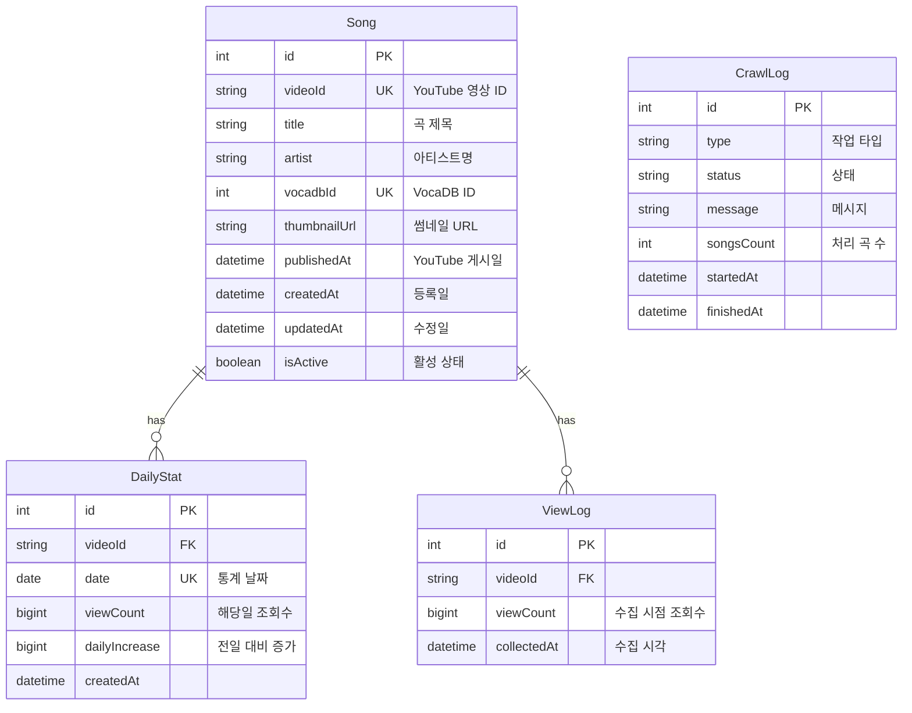

# Vocatify ERD (Entity Relationship Diagram)

## 문서 정보
- **프로젝트**: Vocatify - 보컬로이드 YouTube 일간/월간 차트
- **데이터베이스**: PostgreSQL 14+
- **ORM**: Prisma
- **버전**: 1.0
- **작성일**: 2025-12-16

---

## 1. ERD 다이어그램

### 1.1 전체 구조 (Mermaid 형식)



### 1.2 ASCII 다이어그램

```
┌─────────────────────────────────────────────────────────────┐
│                          Song                                │
├─────────────────────────────────────────────────────────────┤
│ PK  id              INT                                      │
│ UK  videoId         VARCHAR(255)  YouTube 영상 ID           │
│     title           VARCHAR(500)  곡 제목                    │
│     artist          VARCHAR(255)  아티스트                   │
│ UK  vocadbId        INT           VocaDB ID (nullable)       │
│     thumbnailUrl    TEXT          썸네일 URL                 │
│     publishedAt     TIMESTAMP     YouTube 게시일             │
│     createdAt       TIMESTAMP     등록일                     │
│     updatedAt       TIMESTAMP     수정일                     │
│     isActive        BOOLEAN       활성 상태 (default: true)  │
└─────────────────────────────────────────────────────────────┘
                              │
                              │ 1
                              │
                 ┌────────────┴────────────┐
                 │                         │
                 │ *                       │ *
                 ▼                         ▼
┌─────────────────────────────┐  ┌─────────────────────────────┐
│        DailyStat            │  │         ViewLog             │
├─────────────────────────────┤  ├─────────────────────────────┤
│ PK  id          INT         │  │ PK  id          INT         │
│ FK  videoId     VARCHAR     │  │ FK  videoId     VARCHAR     │
│     date        DATE        │  │     viewCount   BIGINT      │
│     viewCount   BIGINT      │  │     collectedAt TIMESTAMP   │
│     dailyIncrease BIGINT    │  │                             │
│     createdAt   TIMESTAMP   │  │ IDX (videoId, collectedAt)  │
│                             │  └─────────────────────────────┘
│ UK  (videoId, date)         │
│ IDX (date)                  │
└─────────────────────────────┘

┌─────────────────────────────────────────────────────────────┐
│                        CrawlLog                              │
├─────────────────────────────────────────────────────────────┤
│ PK  id              INT                                      │
│     type            VARCHAR(50)   작업 타입                  │
│     status          VARCHAR(50)   상태                       │
│     message         TEXT          메시지                     │
│     songsCount      INT           처리 곡 수                 │
│     startedAt       TIMESTAMP     시작 시각                  │
│     finishedAt      TIMESTAMP     종료 시각 (nullable)       │
└─────────────────────────────────────────────────────────────┘
```

---

## 2. 엔티티 상세 명세

### 2.1 Song (곡)

**목적**: YouTube에 업로드된 보컬로이드 곡의 기본 정보 저장

| 컬럼명 | 타입 | 제약조건 | 설명 | 예시 |
|--------|------|----------|------|------|
| id | INT | PK, AUTO_INCREMENT | 내부 ID | 1 |
| videoId | VARCHAR(255) | UNIQUE, NOT NULL | YouTube 영상 ID | `dQw4w9WgXcQ` |
| title | VARCHAR(500) | NOT NULL | 곡 제목 | `千本桜` |
| artist | VARCHAR(255) | NULL | 아티스트/프로듀서명 | `黒うさP` |
| vocadbId | INT | UNIQUE, NULL | VocaDB 곡 ID | 123456 |
| thumbnailUrl | TEXT | NULL | YouTube 썸네일 URL | `https://i.ytimg.com/...` |
| publishedAt | TIMESTAMP | NULL | YouTube 게시일 | `2024-11-15 12:00:00` |
| createdAt | TIMESTAMP | DEFAULT NOW() | DB 등록일 | `2024-12-16 03:00:00` |
| updatedAt | TIMESTAMP | AUTO UPDATE | 마지막 수정일 | `2024-12-16 15:30:00` |
| isActive | BOOLEAN | DEFAULT TRUE | 활성 상태 (삭제된 영상 = false) | true |

**인덱스**:
```sql
CREATE UNIQUE INDEX idx_song_video_id ON songs(video_id);
CREATE UNIQUE INDEX idx_song_vocadb_id ON songs(vocadb_id) WHERE vocadb_id IS NOT NULL;
CREATE INDEX idx_song_published_at ON songs(published_at);
CREATE INDEX idx_song_is_active ON songs(is_active);
```

**비즈니스 규칙**:
- `videoId`는 YouTube 영상 ID 11자리 (예: `dQw4w9WgXcQ`)
- `vocadbId`는 VocaDB API에서 가져온 곡 ID (선택사항)
- `isActive = false`인 곡은 삭제되거나 비공개된 영상
- `publishedAt`은 YouTube API의 `snippet.publishedAt` 값
- `artist`는 VocaDB의 주 프로듀서명 또는 YouTube 채널명

### 2.2 DailyStat (일별 통계)

**목적**: 각 곡의 일별 조회수 및 증가량 집계 데이터

| 컬럼명 | 타입 | 제약조건 | 설명 | 예시 |
|--------|------|----------|------|------|
| id | INT | PK, AUTO_INCREMENT | 내부 ID | 1 |
| videoId | VARCHAR(255) | FK → Song.videoId, NOT NULL | 곡 참조 | `dQw4w9WgXcQ` |
| date | DATE | NOT NULL | 통계 날짜 | `2024-12-16` |
| viewCount | BIGINT | NOT NULL | 해당일 마지막 조회수 | 1234567 |
| dailyIncrease | BIGINT | DEFAULT 0 | 전일 대비 증가량 | 12500 |
| createdAt | TIMESTAMP | DEFAULT NOW() | 생성일 | `2024-12-16 03:05:00` |

**인덱스**:
```sql
CREATE UNIQUE INDEX idx_daily_stat_video_date ON daily_stats(video_id, date);
CREATE INDEX idx_daily_stat_date ON daily_stats(date);
CREATE INDEX idx_daily_stat_daily_increase ON daily_stats(daily_increase DESC);
```

**비즈니스 규칙**:
- `(videoId, date)` 조합은 유니크 (하루 1개 레코드)
- `dailyIncrease = 오늘 viewCount - 어제 viewCount`
- 매일 새벽 3시 Cron 작업으로 생성
- 첫날 데이터는 `dailyIncrease = 0` (비교 대상 없음)

**계산 로직**:
```sql
-- 일별 증가량 계산 예시
INSERT INTO daily_stats (video_id, date, view_count, daily_increase)
SELECT
  video_id,
  CURRENT_DATE,
  current_views,
  GREATEST(0, current_views - COALESCE(yesterday_views, 0)) AS daily_increase
FROM ...
```

### 2.3 ViewLog (조회수 로그)

**목적**: 원본 조회수 수집 이력 (감사 추적 및 데이터 복구용)

| 컬럼명 | 타입 | 제약조건 | 설명 | 예시 |
|--------|------|----------|------|------|
| id | INT | PK, AUTO_INCREMENT | 내부 ID | 1 |
| videoId | VARCHAR(255) | FK → Song.videoId, NOT NULL | 곡 참조 | `dQw4w9WgXcQ` |
| viewCount | BIGINT | NOT NULL | 수집 시점 조회수 | 1234567 |
| collectedAt | TIMESTAMP | DEFAULT NOW() | 수집 시각 | `2024-12-16 03:00:15` |

**인덱스**:
```sql
CREATE INDEX idx_view_log_video_collected ON view_logs(video_id, collected_at DESC);
CREATE INDEX idx_view_log_collected_at ON view_logs(collected_at);
```

**비즈니스 규칙**:
- 매일 1회 YouTube API 수집 시마다 생성
- DailyStat 생성의 소스 데이터
- 데이터 정합성 검증 및 복구에 사용
- 90일 이상 데이터는 아카이빙 고려 (선택사항)

**보관 정책** (권장):
```sql
-- 90일 이전 데이터 삭제 (DailyStat이 있으므로 안전)
DELETE FROM view_logs
WHERE collected_at < NOW() - INTERVAL '90 days';
```

### 2.4 CrawlLog (크롤링 로그)

**목적**: 데이터 수집/동기화 작업의 실행 이력 및 결과 추적

| 컬럼명 | 타입 | 제약조건 | 설명 | 예시 |
|--------|------|----------|------|------|
| id | INT | PK, AUTO_INCREMENT | 내부 ID | 1 |
| type | VARCHAR(50) | NOT NULL | 작업 타입 | `youtube_collect` |
| status | VARCHAR(50) | NOT NULL | 실행 상태 | `success` |
| message | TEXT | NULL | 상세 메시지 | `25,000곡 수집 완료` |
| songsCount | INT | NULL | 처리된 곡 수 | 25000 |
| startedAt | TIMESTAMP | NOT NULL | 시작 시각 | `2024-12-16 03:00:00` |
| finishedAt | TIMESTAMP | NULL | 종료 시각 | `2024-12-16 03:08:45` |

**작업 타입** (`type`):
- `vocadb_sync`: VocaDB 신곡 동기화
- `youtube_collect`: YouTube 조회수 수집
- `daily_aggregate`: 일별 통계 집계
- `cleanup`: 데이터 정리 작업

**실행 상태** (`status`):
- `success`: 성공
- `failed`: 실패
- `partial`: 부분 성공 (일부 에러 발생)
- `running`: 실행 중 (중단된 작업 탐지용)

**인덱스**:
```sql
CREATE INDEX idx_crawl_log_type_started ON crawl_logs(type, started_at DESC);
CREATE INDEX idx_crawl_log_status ON crawl_logs(status);
```

---

## 3. 관계 (Relationships)

### 3.1 Song ↔ DailyStat (1:N)
```
하나의 곡(Song)은 여러 일별 통계(DailyStat)를 가질 수 있음
- 관계 타입: One-to-Many
- 외래키: DailyStat.videoId → Song.videoId
- 삭제 규칙: CASCADE (곡 삭제 시 통계도 삭제)
```

```prisma
model Song {
  videoId    String      @unique
  dailyStats DailyStat[]
}

model DailyStat {
  videoId String
  song    Song   @relation(fields: [videoId], references: [videoId], onDelete: Cascade)
}
```

### 3.2 Song ↔ ViewLog (1:N)
```
하나의 곡(Song)은 여러 조회수 로그(ViewLog)를 가질 수 있음
- 관계 타입: One-to-Many
- 외래키: ViewLog.videoId → Song.videoId
- 삭제 규칙: CASCADE
```

### 3.3 독립 엔티티: CrawlLog
```
CrawlLog는 다른 테이블과 외래키 관계 없음 (독립 로그)
```

---

## 4. Prisma 스키마

### 4.1 완전한 schema.prisma

```prisma
generator client {
  provider = "prisma-client-js"
}

datasource db {
  provider = "postgresql"
  url      = env("DATABASE_URL")
}

// ============================================
// Song: 곡 기본 정보
// ============================================
model Song {
  id           Int         @id @default(autoincrement())
  videoId      String      @unique @map("video_id") @db.VarChar(255)
  title        String      @db.VarChar(500)
  artist       String?     @db.VarChar(255)
  vocadbId     Int?        @unique @map("vocadb_id")
  thumbnailUrl String?     @map("thumbnail_url") @db.Text
  publishedAt  DateTime?   @map("published_at") @db.Timestamp()

  // 메타데이터
  createdAt    DateTime    @default(now()) @map("created_at") @db.Timestamp()
  updatedAt    DateTime    @updatedAt @map("updated_at") @db.Timestamp()
  isActive     Boolean     @default(true) @map("is_active")

  // Relations
  dailyStats   DailyStat[]
  viewLogs     ViewLog[]

  @@index([publishedAt])
  @@index([isActive])
  @@map("songs")
}

// ============================================
// DailyStat: 일별 집계 통계
// ============================================
model DailyStat {
  id            Int      @id @default(autoincrement())
  videoId       String   @map("video_id") @db.VarChar(255)
  date          DateTime @db.Date
  viewCount     BigInt   @map("view_count")
  dailyIncrease BigInt   @default(0) @map("daily_increase")

  createdAt     DateTime @default(now()) @map("created_at") @db.Timestamp()

  // Relations
  song          Song     @relation(fields: [videoId], references: [videoId], onDelete: Cascade)

  @@unique([videoId, date])
  @@index([date])
  @@index([dailyIncrease(sort: Desc)])
  @@map("daily_stats")
}

// ============================================
// ViewLog: 조회수 수집 원본 로그
// ============================================
model ViewLog {
  id          Int      @id @default(autoincrement())
  videoId     String   @map("video_id") @db.VarChar(255)
  viewCount   BigInt   @map("view_count")
  collectedAt DateTime @default(now()) @map("collected_at") @db.Timestamp()

  // Relations
  song        Song     @relation(fields: [videoId], references: [videoId], onDelete: Cascade)

  @@index([videoId, collectedAt(sort: Desc)])
  @@index([collectedAt])
  @@map("view_logs")
}

// ============================================
// CrawlLog: 크롤링 작업 로그
// ============================================
model CrawlLog {
  id         Int       @id @default(autoincrement())
  type       String    @db.VarChar(50)  // vocadb_sync | youtube_collect | daily_aggregate
  status     String    @db.VarChar(50)  // success | failed | partial | running
  message    String?   @db.Text
  songsCount Int?      @map("songs_count")
  startedAt  DateTime  @map("started_at") @db.Timestamp()
  finishedAt DateTime? @map("finished_at") @db.Timestamp()

  @@index([type, startedAt(sort: Desc)])
  @@index([status])
  @@map("crawl_logs")
}
```

### 4.2 마이그레이션 생성

```bash
# 1. Prisma 스키마 작성 후
npx prisma migrate dev --name init

# 2. 클라이언트 생성
npx prisma generate

# 3. Prisma Studio로 확인
npx prisma studio
```

---

## 5. 샘플 쿼리

### 5.1 데이터 조회

#### 일간 랭킹 TOP 100
```typescript
// Prisma
const dailyRanking = await prisma.dailyStat.findMany({
  where: {
    date: new Date('2024-12-16'),
    song: { isActive: true }
  },
  orderBy: {
    dailyIncrease: 'desc'
  },
  take: 100,
  include: {
    song: {
      select: {
        videoId: true,
        title: true,
        artist: true,
        thumbnailUrl: true
      }
    }
  }
});
```

```sql
-- Raw SQL
SELECT
  ds.video_id,
  s.title,
  s.artist,
  s.thumbnail_url,
  ds.view_count,
  ds.daily_increase,
  ROW_NUMBER() OVER (ORDER BY ds.daily_increase DESC) AS rank
FROM daily_stats ds
JOIN songs s ON ds.video_id = s.video_id
WHERE ds.date = '2024-12-16'
  AND s.is_active = true
ORDER BY ds.daily_increase DESC
LIMIT 100;
```

#### 주간 랭킹 (최근 7일 증가량 합산)
```typescript
// Prisma (Raw SQL 사용)
const weeklyRanking = await prisma.$queryRaw`
  SELECT
    s.video_id,
    s.title,
    s.artist,
    s.thumbnail_url,
    SUM(ds.daily_increase) AS weekly_increase,
    MAX(ds.view_count) AS current_views
  FROM songs s
  JOIN daily_stats ds ON s.video_id = ds.video_id
  WHERE ds.date >= CURRENT_DATE - INTERVAL '7 days'
    AND s.is_active = true
  GROUP BY s.video_id, s.title, s.artist, s.thumbnail_url
  ORDER BY weekly_increase DESC
  LIMIT 100
`;
```

#### 월간 랭킹 (최근 30일)
```sql
SELECT
  s.video_id,
  s.title,
  s.artist,
  SUM(ds.daily_increase) AS monthly_increase,
  MAX(ds.view_count) AS current_views
FROM songs s
JOIN daily_stats ds ON s.video_id = ds.video_id
WHERE ds.date >= CURRENT_DATE - INTERVAL '30 days'
  AND s.is_active = true
GROUP BY s.video_id, s.title, s.artist
ORDER BY monthly_increase DESC
LIMIT 100;
```

#### 신곡 차트 (30일 이내 발매)
```typescript
const newSongs = await prisma.song.findMany({
  where: {
    publishedAt: {
      gte: new Date(Date.now() - 30 * 24 * 60 * 60 * 1000)
    },
    isActive: true
  },
  orderBy: {
    dailyStats: {
      _count: 'desc' // 또는 최신 dailyIncrease로 정렬
    }
  },
  take: 100,
  include: {
    dailyStats: {
      orderBy: { date: 'desc' },
      take: 1
    }
  }
});
```

```sql
-- Raw SQL
SELECT
  s.*,
  ds.view_count AS current_views,
  ds.daily_increase
FROM songs s
LEFT JOIN LATERAL (
  SELECT view_count, daily_increase
  FROM daily_stats
  WHERE video_id = s.video_id
  ORDER BY date DESC
  LIMIT 1
) ds ON true
WHERE s.published_at >= CURRENT_DATE - INTERVAL '30 days'
  AND s.is_active = true
ORDER BY ds.view_count DESC
LIMIT 100;
```

#### 곡 상세 (조회수 추이)
```typescript
const songDetail = await prisma.song.findUnique({
  where: { videoId: 'dQw4w9WgXcQ' },
  include: {
    dailyStats: {
      where: {
        date: {
          gte: new Date(Date.now() - 90 * 24 * 60 * 60 * 1000) // 최근 90일
        }
      },
      orderBy: { date: 'asc' }
    }
  }
});
```

### 5.2 데이터 수집 (Cron 작업)

#### YouTube 조회수 수집 → ViewLog 생성
```typescript
async function collectViewCounts(songs: Song[]) {
  const batchSize = 50; // YouTube API 제한
  const batches = chunk(songs, batchSize);

  for (const batch of batches) {
    const videoIds = batch.map(s => s.videoId).join(',');

    // YouTube API 호출
    const response = await youtube.videos.list({
      part: ['statistics'],
      id: videoIds
    });

    // ViewLog 저장
    const viewLogs = response.data.items.map(item => ({
      videoId: item.id,
      viewCount: BigInt(item.statistics.viewCount),
      collectedAt: new Date()
    }));

    await prisma.viewLog.createMany({
      data: viewLogs
    });
  }
}
```

#### ViewLog → DailyStat 집계
```typescript
async function aggregateDailyStats(date: Date) {
  const startOfDay = new Date(date.setHours(0, 0, 0, 0));
  const endOfDay = new Date(date.setHours(23, 59, 59, 999));

  // 오늘 수집된 마지막 ViewLog 조회
  const todayLogs = await prisma.viewLog.groupBy({
    by: ['videoId'],
    where: {
      collectedAt: {
        gte: startOfDay,
        lte: endOfDay
      }
    },
    _max: {
      viewCount: true,
      collectedAt: true
    }
  });

  // 어제 DailyStat 조회 (증가량 계산용)
  const yesterday = new Date(date);
  yesterday.setDate(yesterday.getDate() - 1);

  const yesterdayStats = await prisma.dailyStat.findMany({
    where: { date: yesterday }
  });

  const yesterdayMap = new Map(
    yesterdayStats.map(s => [s.videoId, s.viewCount])
  );

  // DailyStat 생성
  const dailyStats = todayLogs.map(log => ({
    videoId: log.videoId,
    date: startOfDay,
    viewCount: log._max.viewCount,
    dailyIncrease: log._max.viewCount - (yesterdayMap.get(log.videoId) || 0n)
  }));

  await prisma.dailyStat.createMany({
    data: dailyStats,
    skipDuplicates: true
  });
}
```

### 5.3 유지보수 쿼리

#### 삭제된 영상 감지 (YouTube API 에러 처리)
```typescript
async function markDeletedVideos(failedVideoIds: string[]) {
  await prisma.song.updateMany({
    where: {
      videoId: { in: failedVideoIds }
    },
    data: {
      isActive: false
    }
  });
}
```

#### 오래된 ViewLog 삭제 (90일 보관)
```sql
DELETE FROM view_logs
WHERE collected_at < NOW() - INTERVAL '90 days';
```

#### 크롤링 로그 조회 (최근 실행 상태)
```typescript
const recentLogs = await prisma.crawlLog.findMany({
  where: {
    type: 'youtube_collect'
  },
  orderBy: {
    startedAt: 'desc'
  },
  take: 10
});
```

---

## 6. 인덱스 최적화

### 6.1 성능 크리티컬 인덱스

```sql
-- 일간 랭킹 조회 (가장 빈번)
CREATE INDEX idx_daily_stat_date_increase
ON daily_stats(date, daily_increase DESC);

-- 신곡 조회
CREATE INDEX idx_song_published_active
ON songs(published_at DESC, is_active)
WHERE is_active = true;

-- 조회수 추이 (곡 상세 페이지)
CREATE INDEX idx_daily_stat_video_date_asc
ON daily_stats(video_id, date ASC);

-- ViewLog 최신 조회
CREATE INDEX idx_view_log_video_latest
ON view_logs(video_id, collected_at DESC);
```

### 6.2 복합 인덱스 전략

**자주 사용되는 WHERE 조건 조합**:
```sql
-- 활성 곡의 최신 통계
WHERE s.is_active = true AND ds.date = '2024-12-16'
→ INDEX ON daily_stats(date) + INDEX ON songs(is_active)

-- 신곡 중 인기곡
WHERE published_at >= ... AND view_count > ...
→ INDEX ON songs(published_at, is_active)
```

---

## 7. 데이터 볼륨 예측

### 7.1 저장 용량 계산

**가정**:
- 곡 수: 25,000곡
- 운영 기간: 1년

| 테이블 | 행 수 (1년) | 행 크기 | 총 용량 |
|--------|------------|---------|---------|
| Song | 25,000 | ~500 bytes | 12 MB |
| DailyStat | 9,125,000 | ~50 bytes | 440 MB |
| ViewLog | 9,125,000 | ~40 bytes | 350 MB |
| CrawlLog | 1,095 | ~200 bytes | 0.2 MB |
| **총합** | | | **~802 MB** |

**인덱스 오버헤드**: 약 30% 추가 → **1.05 GB**

**결론**: Supabase 무료 티어 (500MB) 초과, Pro 티어 (8GB) 충분

### 7.2 쿼리 성능 예측

**일간 랭킹 TOP 100** (가장 빈번한 쿼리):
```sql
-- 실행 계획
EXPLAIN ANALYZE
SELECT ...
FROM daily_stats ds
JOIN songs s ON ...
WHERE ds.date = CURRENT_DATE
ORDER BY ds.daily_increase DESC
LIMIT 100;

-- 예상 성능
- 스캔 행수: ~25,000 (date 인덱스 사용)
- 실행 시간: < 50ms (인덱스 히트)
- 캐시 시: < 10ms
```

---

## 8. 보안 고려사항

### 8.1 접근 제어 (Row Level Security)

Supabase 사용 시 RLS 정책:

```sql
-- 읽기는 모두 허용
CREATE POLICY "Public read access"
ON songs FOR SELECT
TO anon, authenticated
USING (true);

-- 쓰기는 서비스 역할만
CREATE POLICY "Service role only"
ON songs FOR ALL
TO service_role
USING (true);
```

### 8.2 민감 정보 보호

- API 키: 환경 변수 관리 (절대 코드에 하드코딩 금지)
- 데이터베이스 접근: 최소 권한 원칙
- 백업: 자동 백업 활성화 (Supabase Pro 또는 VPS cron)

---

## 9. 마이그레이션 전략

### 9.1 초기 시딩

```typescript
// scripts/seed.ts
import { PrismaClient } from '@prisma/client';
import { seedFromVocaDB } from './vocadb-seeder';
import { collectInitialViews } from './youtube-collector';

const prisma = new PrismaClient();

async function main() {
  console.log('Starting seed...');

  // 1. VocaDB에서 곡 목록 가져오기 (25,000곡)
  const songs = await seedFromVocaDB({ limit: 25000 });

  // 2. Song 테이블에 저장
  await prisma.song.createMany({
    data: songs,
    skipDuplicates: true
  });

  // 3. 초기 조회수 수집
  await collectInitialViews();

  console.log('Seed completed!');
}

main()
  .catch(console.error)
  .finally(() => prisma.$disconnect());
```

### 9.2 데이터 아카이빙

**오래된 ViewLog 아카이빙** (선택사항):
```sql
-- 1. 아카이브 테이블 생성
CREATE TABLE view_logs_archive (LIKE view_logs INCLUDING ALL);

-- 2. 90일 이전 데이터 이동
INSERT INTO view_logs_archive
SELECT * FROM view_logs
WHERE collected_at < NOW() - INTERVAL '90 days';

-- 3. 원본 삭제
DELETE FROM view_logs
WHERE collected_at < NOW() - INTERVAL '90 days';
```

---

## 10. 체크리스트

### 개발 단계
- [ ] Prisma 스키마 작성
- [ ] 마이그레이션 실행
- [ ] 시드 스크립트 작성
- [ ] 샘플 데이터 생성 (테스트용)

### 최적화 단계
- [ ] 인덱스 추가 확인
- [ ] 쿼리 성능 테스트 (EXPLAIN ANALYZE)
- [ ] 캐싱 전략 수립 (Redis 또는 Next.js Cache)

### 운영 단계
- [ ] 백업 자동화 설정
- [ ] 모니터링 설정 (쿼리 성능, 디스크 사용량)
- [ ] 아카이빙 정책 수립 및 적용
- [ ] RLS 정책 검토 (Supabase)

---

## 부록: 데이터베이스 설정

### PostgreSQL 설정 권장사항

```sql
-- postgresql.conf

-- 연결 설정
max_connections = 100
shared_buffers = 256MB       # 서버 RAM의 25%
effective_cache_size = 1GB   # 서버 RAM의 50-75%

-- 쿼리 최적화
work_mem = 16MB
maintenance_work_mem = 128MB
random_page_cost = 1.1       # SSD 사용 시

-- 로깅
log_min_duration_statement = 1000  # 1초 이상 쿼리 로깅
log_line_prefix = '%t [%p]: '
```

### Supabase 설정

```typescript
// lib/supabase.ts
import { createClient } from '@supabase/supabase-js';

export const supabase = createClient(
  process.env.NEXT_PUBLIC_SUPABASE_URL!,
  process.env.SUPABASE_SERVICE_ROLE_KEY!, // 서버 사이드 전용
  {
    auth: { persistSession: false }
  }
);
```

---

**ERD 문서 종료**

이 ERD를 기반으로 Prisma 마이그레이션을 실행하고 개발을 시작하시면 됩니다!
질문이나 추가 명세가 필요하시면 말씀해주세요.
