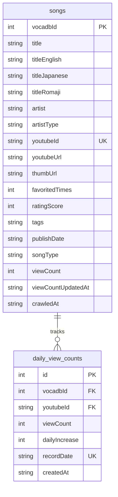

# Vocatify ERD (Entity Relationship Diagram)

## 문서 정보
- **프로젝트**: Vocatify - 보컬로이드 YouTube 일간/월간 차트
- **데이터베이스**: SQLite 3
- **버전**: 2.0
- **작성일**: 2025-12-18
- **변경사항**: VocaDB 크롤링 구조 반영 + 일별 조회수 추이 추적

---

## 1. ERD 다이어그램

### 1.1 전체 구조 (Mermaid 형식)



### 1.2 ASCII 다이어그램

```
┌─────────────────────────────────────────────────────────────────┐
│                            songs                                 │
├─────────────────────────────────────────────────────────────────┤
│ PK  vocadbId           INTEGER        VocaDB 곡 ID              │
│     title              TEXT           곡 제목 (선호 언어)        │
│     titleEnglish       TEXT           영어 제목                  │
│     titleJapanese      TEXT           일본어 제목                │
│     titleRomaji        TEXT           로마자 제목                │
│     artist             TEXT           아티스트                   │
│     artistType         TEXT           아티스트 타입              │
│ UK  youtubeId          TEXT           YouTube 영상 ID           │
│     youtubeUrl         TEXT           YouTube URL               │
│     thumbUrl           TEXT           썸네일 URL                 │
│     favoritedTimes     INTEGER        VocaDB 즐겨찾기 수         │
│     ratingScore        INTEGER        VocaDB 평점               │
│     tags               TEXT           태그 (JSON)                │
│     publishDate        TEXT           발행일                     │
│     songType           TEXT           곡 타입 (Original)         │
│     viewCount          INTEGER        최신 조회수 (캐시)         │
│     viewCountUpdatedAt TEXT           조회수 업데이트 시각       │
│     crawledAt          TEXT           크롤링 시각                │
└─────────────────────────────────────────────────────────────────┘
                              │
                              │ 1
                              │
                              │ *
                              ▼
┌─────────────────────────────────────────────────────────────────┐
│                      daily_view_counts                           │
├─────────────────────────────────────────────────────────────────┤
│ PK  id                 INTEGER        자동 증가 ID              │
│ FK  vocadbId           INTEGER        곡 참조 (VocaDB)          │
│ FK  youtubeId          TEXT           곡 참조 (YouTube)         │
│     viewCount          INTEGER        해당일 조회수              │
│     dailyIncrease      INTEGER        전일 대비 증가량           │
│     recordDate         TEXT           기록 날짜 (YYYY-MM-DD)    │
│     createdAt          TEXT           생성 시각                  │
│                                                                  │
│ UK  (youtubeId, recordDate)  하루 1개 레코드                    │
│ IDX (recordDate)             날짜별 조회 최적화                  │
│ IDX (vocadbId)               곡별 조회 최적화                    │
│ IDX (dailyIncrease DESC)     랭킹 조회 최적화                    │
└─────────────────────────────────────────────────────────────────┘
```

---

## 2. 엔티티 상세 명세

### 2.1 songs (곡 기본 정보)

**목적**: VocaDB에서 크롤링한 보컬로이드 곡의 모든 정보 저장

| 컬럼명 | 타입 | 제약조건 | 설명 | 예시 |
|--------|------|----------|------|------|
| vocadbId | INTEGER | PRIMARY KEY | VocaDB 곡 ID | 123456 |
| title | TEXT | NOT NULL | 선호 언어 제목 | `千本桜` |
| titleEnglish | TEXT | NULL | 영어 제목 | `Senbonzakura` |
| titleJapanese | TEXT | NULL | 일본어 제목 | `千本桜` |
| titleRomaji | TEXT | NULL | 로마자 제목 | `Senbonzakura` |
| artist | TEXT | NOT NULL | 아티스트명 | `黒うさP feat. 初音ミク` |
| artistType | TEXT | NULL | 아티스트 타입 | `Vocaloid` 또는 `Producer` |
| youtubeId | TEXT | NOT NULL, UNIQUE | YouTube 영상 ID | `K_xTet06SUo` |
| youtubeUrl | TEXT | NOT NULL | YouTube 전체 URL | `https://www.youtube.com/watch?v=K_xTet06SUo` |
| thumbUrl | TEXT | NULL | 썸네일 URL | `https://...` |
| favoritedTimes | INTEGER | DEFAULT 0 | VocaDB 즐겨찾기 수 | 1250 |
| ratingScore | INTEGER | DEFAULT 0 | VocaDB 평점 | 85 |
| tags | TEXT | NULL | 태그 (JSON 문자열) | `["Rock", "Electronic"]` |
| publishDate | TEXT | NULL | YouTube 발행일 | `2024-11-15` |
| songType | TEXT | NULL | 곡 타입 | `Original` |
| viewCount | INTEGER | NULL | 최신 조회수 (캐시) | 1234567 |
| viewCountUpdatedAt | TEXT | NULL | 조회수 업데이트 시각 | `2024-12-18 15:30:00` |
| crawledAt | TEXT | NOT NULL | VocaDB 크롤링 시각 | `2024-12-16 03:00:00` |

**인덱스**:
```sql
CREATE UNIQUE INDEX idx_songs_youtube ON songs(youtubeId);
CREATE INDEX idx_songs_viewcount ON songs(viewCount DESC);
CREATE INDEX idx_songs_favorited ON songs(favoritedTimes DESC);
CREATE INDEX idx_songs_rating ON songs(ratingScore DESC);
CREATE INDEX idx_songs_publish ON songs(publishDate DESC);
```

**비즈니스 규칙**:
- `vocadbId`는 VocaDB API의 고유 ID
- `youtubeId`는 YouTube 영상 ID (11자리)
- `title`은 다국어 우선순위: English > Romaji > Japanese > Default
- `viewCount`는 최신 조회수 캐시 (daily_view_counts에서 최신값)
- `viewCountUpdatedAt`은 YouTube API 마지막 수집 시각

### 2.2 daily_view_counts (일별 조회수 추이)

**목적**: 매일 YouTube 조회수를 기록하여 일간/주간/월간 차트 생성

| 컬럼명 | 타입 | 제약조건 | 설명 | 예시 |
|--------|------|----------|------|------|
| id | INTEGER | PRIMARY KEY AUTOINCREMENT | 내부 ID | 1 |
| vocadbId | INTEGER | FOREIGN KEY → songs.vocadbId | VocaDB 곡 참조 | 123456 |
| youtubeId | TEXT | FOREIGN KEY → songs.youtubeId | YouTube 곡 참조 | `K_xTet06SUo` |
| viewCount | INTEGER | NOT NULL | 해당일 조회수 | 1234567 |
| dailyIncrease | INTEGER | DEFAULT 0 | 전일 대비 증가량 | 15000 |
| recordDate | TEXT | NOT NULL | 기록 날짜 (YYYY-MM-DD) | `2024-12-18` |
| createdAt | TEXT | DEFAULT CURRENT_TIMESTAMP | 생성 시각 | `2024-12-18 03:05:00` |

**인덱스**:
```sql
CREATE UNIQUE INDEX idx_daily_youtube_date ON daily_view_counts(youtubeId, recordDate);
CREATE INDEX idx_daily_vocadb ON daily_view_counts(vocadbId);
CREATE INDEX idx_daily_date ON daily_view_counts(recordDate DESC);
CREATE INDEX idx_daily_increase ON daily_view_counts(dailyIncrease DESC);
CREATE INDEX idx_daily_date_increase ON daily_view_counts(recordDate, dailyIncrease DESC);
```

**비즈니스 규칙**:
- `(youtubeId, recordDate)` 조합은 유니크 (하루 1개 레코드)
- `dailyIncrease = 오늘 viewCount - 어제 viewCount`
- 매일 새벽 3시 자동 수집 (YouTube API)
- 첫날 데이터는 `dailyIncrease = 0` (비교 대상 없음)

**계산 로직**:
```sql
-- 일별 증가량 계산
INSERT INTO daily_view_counts (youtubeId, vocadbId, viewCount, dailyIncrease, recordDate)
SELECT
  s.youtubeId,
  s.vocadbId,
  s.viewCount AS current_view,
  COALESCE(s.viewCount - prev.viewCount, 0) AS daily_increase,
  date('now') AS record_date
FROM songs s
LEFT JOIN daily_view_counts prev ON prev.youtubeId = s.youtubeId
  AND prev.recordDate = date('now', '-1 day')
WHERE s.viewCount IS NOT NULL;
```

---

## 3. 관계 (Relationships)

### 3.1 songs ↔ daily_view_counts (1:N)
```
하나의 곡(songs)은 여러 일별 조회수 기록(daily_view_counts)을 가질 수 있음
- 관계 타입: One-to-Many
- 외래키: daily_view_counts.vocadbId → songs.vocadbId
          daily_view_counts.youtubeId → songs.youtubeId
- 삭제 규칙: CASCADE (곡 삭제 시 기록도 삭제)
```

---

## 4. SQLite 스키마

### 4.1 완전한 CREATE TABLE 문

```sql
-- ============================================
-- songs: 곡 기본 정보 (VocaDB + YouTube)
-- ============================================
CREATE TABLE IF NOT EXISTS songs (
  vocadbId INTEGER PRIMARY KEY,
  title TEXT NOT NULL,
  titleEnglish TEXT,
  titleJapanese TEXT,
  titleRomaji TEXT,
  artist TEXT NOT NULL,
  artistType TEXT,
  youtubeId TEXT NOT NULL UNIQUE,
  youtubeUrl TEXT NOT NULL,
  thumbUrl TEXT,
  favoritedTimes INTEGER DEFAULT 0,
  ratingScore INTEGER DEFAULT 0,
  tags TEXT,
  publishDate TEXT,
  songType TEXT,
  viewCount INTEGER,
  viewCountUpdatedAt TEXT,
  crawledAt TEXT NOT NULL
);

-- songs 인덱스
CREATE UNIQUE INDEX IF NOT EXISTS idx_songs_youtube ON songs(youtubeId);
CREATE INDEX IF NOT EXISTS idx_songs_viewcount ON songs(viewCount DESC);
CREATE INDEX IF NOT EXISTS idx_songs_favorited ON songs(favoritedTimes DESC);
CREATE INDEX IF NOT EXISTS idx_songs_rating ON songs(ratingScore DESC);
CREATE INDEX IF NOT EXISTS idx_songs_publish ON songs(publishDate DESC);

-- ============================================
-- daily_view_counts: 일별 조회수 추이
-- ============================================
CREATE TABLE IF NOT EXISTS daily_view_counts (
  id INTEGER PRIMARY KEY AUTOINCREMENT,
  vocadbId INTEGER NOT NULL,
  youtubeId TEXT NOT NULL,
  viewCount INTEGER NOT NULL,
  dailyIncrease INTEGER DEFAULT 0,
  recordDate TEXT NOT NULL,
  createdAt TEXT DEFAULT CURRENT_TIMESTAMP,

  FOREIGN KEY (vocadbId) REFERENCES songs(vocadbId) ON DELETE CASCADE,
  FOREIGN KEY (youtubeId) REFERENCES songs(youtubeId) ON DELETE CASCADE
);

-- daily_view_counts 인덱스
CREATE UNIQUE INDEX IF NOT EXISTS idx_daily_youtube_date
  ON daily_view_counts(youtubeId, recordDate);
CREATE INDEX IF NOT EXISTS idx_daily_vocadb
  ON daily_view_counts(vocadbId);
CREATE INDEX IF NOT EXISTS idx_daily_date
  ON daily_view_counts(recordDate DESC);
CREATE INDEX IF NOT EXISTS idx_daily_increase
  ON daily_view_counts(dailyIncrease DESC);
CREATE INDEX IF NOT EXISTS idx_daily_date_increase
  ON daily_view_counts(recordDate, dailyIncrease DESC);
```

---

## 5. 샘플 쿼리

### 5.1 데이터 조회

#### 일간 랭킹 TOP 100 (오늘)
```sql
-- 오늘 일별 증가량 기준 랭킹
SELECT
  s.vocadbId,
  s.title,
  s.titleEnglish,
  s.artist,
  s.youtubeUrl,
  s.thumbUrl,
  d.viewCount,
  d.dailyIncrease,
  ROW_NUMBER() OVER (ORDER BY d.dailyIncrease DESC) AS rank
FROM daily_view_counts d
JOIN songs s ON d.youtubeId = s.youtubeId
WHERE d.recordDate = date('now')
ORDER BY d.dailyIncrease DESC
LIMIT 100;
```

#### 주간 랭킹 (최근 7일 증가량 합산)
```sql
SELECT
  s.vocadbId,
  s.title,
  s.artist,
  s.youtubeUrl,
  s.thumbUrl,
  SUM(d.dailyIncrease) AS weeklyIncrease,
  MAX(d.viewCount) AS currentViews
FROM songs s
JOIN daily_view_counts d ON s.youtubeId = d.youtubeId
WHERE d.recordDate >= date('now', '-7 days')
GROUP BY s.vocadbId, s.title, s.artist
ORDER BY weeklyIncrease DESC
LIMIT 100;
```

#### 월간 랭킹 (최근 30일)
```sql
SELECT
  s.vocadbId,
  s.title,
  s.artist,
  s.youtubeUrl,
  SUM(d.dailyIncrease) AS monthlyIncrease,
  MAX(d.viewCount) AS currentViews
FROM songs s
JOIN daily_view_counts d ON s.youtubeId = d.youtubeId
WHERE d.recordDate >= date('now', '-30 days')
GROUP BY s.vocadbId, s.title, s.artist
ORDER BY monthlyIncrease DESC
LIMIT 100;
```

#### 신곡 차트 (최근 30일 발매)
```sql
SELECT
  s.vocadbId,
  s.title,
  s.artist,
  s.publishDate,
  s.viewCount,
  COALESCE(d.dailyIncrease, 0) AS todayIncrease
FROM songs s
LEFT JOIN daily_view_counts d ON s.youtubeId = d.youtubeId
  AND d.recordDate = date('now')
WHERE s.publishDate >= date('now', '-30 days')
ORDER BY s.viewCount DESC
LIMIT 100;
```

#### 곡 상세 + 조회수 추이 (최근 90일)
```sql
-- 곡 기본 정보
SELECT * FROM songs WHERE youtubeId = 'K_xTet06SUo';

-- 조회수 추이 데이터
SELECT
  recordDate,
  viewCount,
  dailyIncrease
FROM daily_view_counts
WHERE youtubeId = 'K_xTet06SUo'
  AND recordDate >= date('now', '-90 days')
ORDER BY recordDate ASC;
```

### 5.2 데이터 수집 (일일 작업)

#### 1단계: YouTube API로 최신 조회수 수집 → songs 업데이트
```sql
-- TypeScript/Node.js에서 실행 후
UPDATE songs
SET viewCount = ?,
    viewCountUpdatedAt = datetime('now')
WHERE youtubeId = ?;
```

#### 2단계: daily_view_counts 생성
```sql
-- 오늘 데이터 생성
INSERT INTO daily_view_counts (vocadbId, youtubeId, viewCount, dailyIncrease, recordDate)
SELECT
  s.vocadbId,
  s.youtubeId,
  s.viewCount,
  COALESCE(s.viewCount - prev.viewCount, 0) AS dailyIncrease,
  date('now') AS recordDate
FROM songs s
LEFT JOIN daily_view_counts prev ON prev.youtubeId = s.youtubeId
  AND prev.recordDate = date('now', '-1 day')
WHERE s.viewCount IS NOT NULL;
```

### 5.3 유지보수 쿼리

#### 통계 확인
```sql
-- 전체 곡 수
SELECT COUNT(*) AS total_songs FROM songs;

-- 조회수 데이터 있는 곡 수
SELECT COUNT(*) AS songs_with_views FROM songs WHERE viewCount IS NOT NULL;

-- 일별 기록 총 개수
SELECT COUNT(*) AS total_records FROM daily_view_counts;

-- 최신 기록 날짜
SELECT MAX(recordDate) AS latest_date FROM daily_view_counts;

-- 오늘 기록된 곡 수
SELECT COUNT(*) AS today_records FROM daily_view_counts WHERE recordDate = date('now');
```

#### 데이터 정합성 검증
```sql
-- 중복 레코드 확인
SELECT youtubeId, recordDate, COUNT(*) AS duplicates
FROM daily_view_counts
GROUP BY youtubeId, recordDate
HAVING COUNT(*) > 1;

-- 조회수 없는 곡 확인
SELECT COUNT(*) FROM songs WHERE viewCount IS NULL;

-- 마이너스 증가량 확인 (비정상 데이터)
SELECT * FROM daily_view_counts WHERE dailyIncrease < 0 LIMIT 10;
```

#### 오래된 데이터 삭제 (선택사항)
```sql
-- 1년 이전 데이터 삭제
DELETE FROM daily_view_counts
WHERE recordDate < date('now', '-365 days');

-- 삭제 후 DB 최적화
VACUUM;
```

---

## 6. 인덱스 최적화

### 6.1 성능 크리티컬 인덱스

```sql
-- 일간 랭킹 조회 (가장 빈번)
CREATE INDEX idx_daily_date_increase
  ON daily_view_counts(recordDate, dailyIncrease DESC);

-- 곡별 조회수 추이
CREATE INDEX idx_daily_youtube_date_asc
  ON daily_view_counts(youtubeId, recordDate ASC);

-- 전체 조회수 랭킹
CREATE INDEX idx_songs_viewcount_desc
  ON songs(viewCount DESC) WHERE viewCount IS NOT NULL;
```

### 6.2 쿼리 성능 분석

```sql
-- 쿼리 실행 계획 확인
EXPLAIN QUERY PLAN
SELECT ...
FROM daily_view_counts d
JOIN songs s ON d.youtubeId = s.youtubeId
WHERE d.recordDate = date('now')
ORDER BY d.dailyIncrease DESC
LIMIT 100;
```

---

## 7. 데이터 볼륨 예측

### 7.1 저장 용량 계산

**가정**:
- 곡 수: 277,000곡
- 운영 기간: 1년

| 테이블 | 행 수 (1년) | 행 크기 | 총 용량 |
|--------|------------|---------|---------|
| songs | 277,000 | ~400 bytes | 108 MB |
| daily_view_counts | 101,105,000 | ~60 bytes | 5.8 GB |
| **총합** | | | **~5.9 GB** |

**인덱스 오버헤드**: 약 30% 추가 → **7.7 GB**

**최적화 후** (1년 이전 데이터 삭제): **~2.5 GB**

---

## 8. 마이그레이션 전략

### 8.1 기존 DB에 daily_view_counts 추가

```typescript
// scripts/db/add-daily-tracking.ts
import Database from 'better-sqlite3';
import path from 'path';

const dbPath = path.join(process.cwd(), 'data', 'vocadb', 'vocatify.db');
const db = new Database(dbPath);

// daily_view_counts 테이블 생성
db.exec(`
  CREATE TABLE IF NOT EXISTS daily_view_counts (
    id INTEGER PRIMARY KEY AUTOINCREMENT,
    vocadbId INTEGER NOT NULL,
    youtubeId TEXT NOT NULL,
    viewCount INTEGER NOT NULL,
    dailyIncrease INTEGER DEFAULT 0,
    recordDate TEXT NOT NULL,
    createdAt TEXT DEFAULT CURRENT_TIMESTAMP,

    FOREIGN KEY (vocadbId) REFERENCES songs(vocadbId) ON DELETE CASCADE,
    FOREIGN KEY (youtubeId) REFERENCES songs(youtubeId) ON DELETE CASCADE
  );

  CREATE UNIQUE INDEX IF NOT EXISTS idx_daily_youtube_date
    ON daily_view_counts(youtubeId, recordDate);
  CREATE INDEX IF NOT EXISTS idx_daily_vocadb
    ON daily_view_counts(vocadbId);
  CREATE INDEX IF NOT EXISTS idx_daily_date
    ON daily_view_counts(recordDate DESC);
  CREATE INDEX IF NOT EXISTS idx_daily_increase
    ON daily_view_counts(dailyIncrease DESC);
  CREATE INDEX IF NOT EXISTS idx_daily_date_increase
    ON daily_view_counts(recordDate, dailyIncrease DESC);
`);

console.log('✅ daily_view_counts 테이블 생성 완료');
db.close();
```

### 8.2 초기 데이터 마이그레이션

```typescript
// 현재 songs.viewCount를 첫 날 데이터로 기록
db.exec(`
  INSERT INTO daily_view_counts (vocadbId, youtubeId, viewCount, dailyIncrease, recordDate)
  SELECT
    vocadbId,
    youtubeId,
    viewCount,
    0 AS dailyIncrease,
    date('now') AS recordDate
  FROM songs
  WHERE viewCount IS NOT NULL;
`);

console.log('✅ 초기 데이터 마이그레이션 완료');
```

---

## 9. 체크리스트

### 개발 단계
- [x] songs 테이블 생성 (VocaDB 크롤러로 완료)
- [x] YouTube API 조회수 수집 스크립트
- [ ] daily_view_counts 테이블 생성
- [ ] 일별 조회수 수집 스크립트
- [ ] Cron 작업 설정 (매일 새벽 3시)

### 최적화 단계
- [ ] 인덱스 추가 확인
- [ ] 쿼리 성능 테스트
- [ ] 데이터 아카이빙 정책 수립

### 운영 단계
- [ ] 백업 자동화 설정
- [ ] 모니터링 설정
- [ ] 일간/주간/월간 랭킹 API 구현

---

**ERD 문서 종료**

이 ERD를 기반으로 일별 조회수 추이 추적 시스템을 구현하세요!
